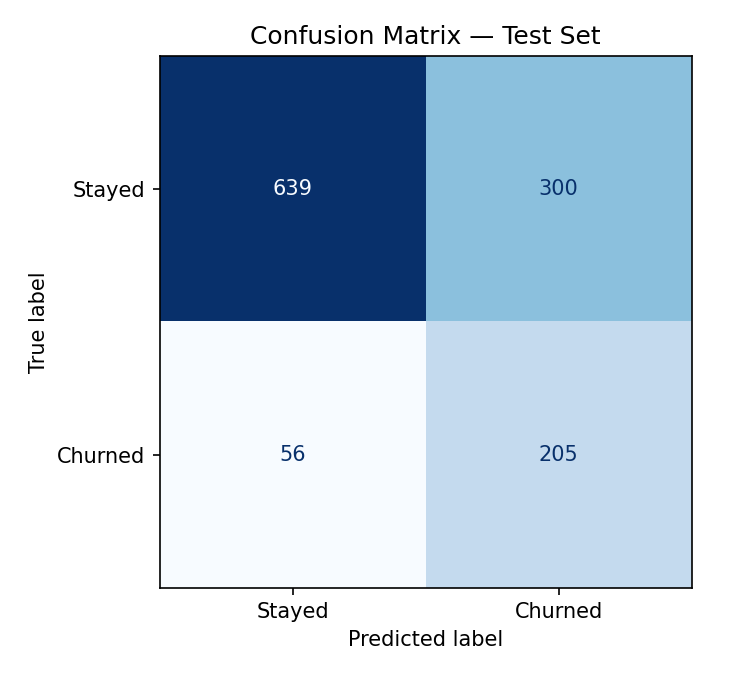
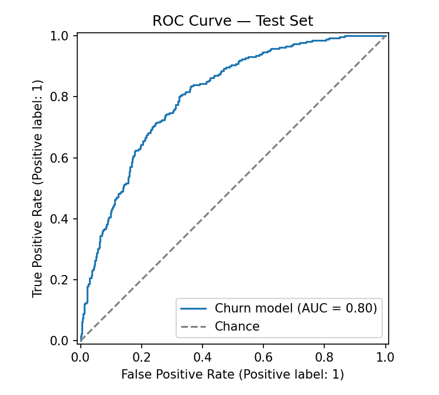
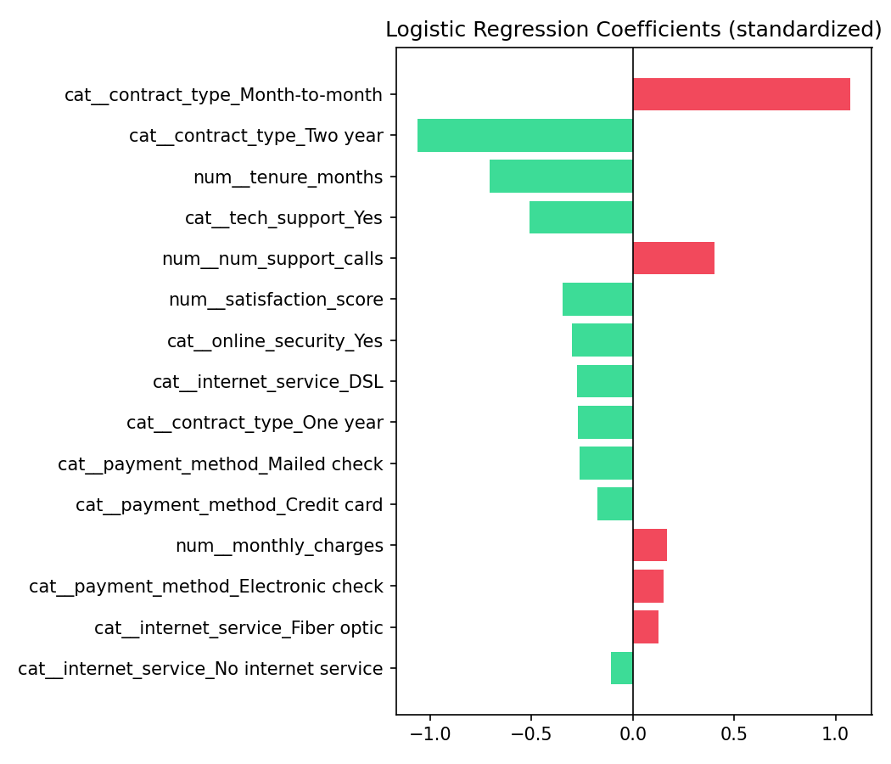

# ChurnScope

**An end-to-end customer churn prediction system** — synthetic data generation, feature engineering, model comparison, evaluation, and a live in-browser risk demo, built the way a data/ML team would ship it internally.

> Built as a portfolio reference project. The dataset is synthetically generated by a documented, seeded process (`data/generate_data.py`) that encodes realistic telecom churn drivers, so results are reproducible and the model's learned behavior can be sanity-checked against the known ground truth.

---

## 1. Problem framing

A subscription telecom business loses revenue every time a customer cancels. Retention teams have limited outreach capacity (calls, discount offers, account check-ins) and need to prioritize *which* customers to contact. The goal of this project is a model that:

1. Scores every customer with a **probability of churn**
2. Explains **which factors are driving that risk** for a given customer
3. Is tuned to **catch as many true churners as possible** (high recall), since in this business the cost of an unanswered churn signal (lost revenue) outweighs the cost of an unnecessary retention call (a few minutes of an agent's time)

## 2. Results

Three model families were trained with 5-fold cross-validated grid search over held-out data (6,000 customers, 80/20 train/test split, stratified on churn):

| Model | CV ROC-AUC | Test ROC-AUC | Notes |
|---|---|---|---|
| **Logistic Regression** ✅ | 0.793 | **0.804** | Selected — best test AUC, fully interpretable coefficients |
| Gradient Boosting | 0.785 | 0.792 | Close second, less interpretable |
| Random Forest | 0.778 | 0.785 | Weakest of the three here |

**Selected model — Logistic Regression (`C=1.0`, class-balanced):**

| Metric (Churned class) | Score |
|---|---|
| Precision | 0.41 |
| Recall | **0.79** |
| F1 | 0.54 |
| Overall ROC-AUC | 0.80 |

Precision is intentionally traded off for recall via `class_weight="balanced"` — the model flags roughly twice as many customers as will actually churn, which is the right trade for a retention-outreach use case (see §1). On the 1,200-customer test set, the model flagged 505 customers as high-risk, representing an estimated **$385,504/year** in at-risk revenue the retention team could act on.

Figures generated by `src/evaluate.py`:





## 3. What drives churn (model-learned, matches domain intuition)

Top coefficients from the selected model, standardized so magnitudes are comparable:

- **Increases risk:** month-to-month contracts, frequent support calls, higher monthly charges, fiber internet (a proxy for a pricier, less "locked-in" plan), electronic-check payment
- **Reduces risk:** longer tenure, two-year contracts, having tech support or online security add-ons, higher satisfaction scores

These line up with what telecom retention teams generally observe, which is a useful sanity check that the model learned real signal rather than noise.

## 4. Project structure

```
churnscope/
├── data/
│   ├── generate_data.py      # documented synthetic data generating process
│   └── telecom_churn.csv     # generated dataset (6,000 customers)
├── src/
│   ├── preprocessing.py      # feature engineering + sklearn ColumnTransformer
│   ├── train.py              # trains & grid-searches 3 model families, saves best
│   ├── evaluate.py           # metrics, plots, business-value summary
│   └── predict.py            # CLI to score new customers or a single record
├── app/
│   └── index.html            # standalone interactive risk demo (client-side, no server)
├── models/                   # saved pipeline, metrics, exported coefficients (generated)
├── reports/figures/          # evaluation plots (generated)
├── tests/
│   └── test_pipeline.py      # pytest suite: data integrity, pipeline, predictions
├── requirements.txt
└── README.md
```

## 5. Running it yourself

```bash
pip install -r requirements.txt

# 1. Generate the dataset
python data/generate_data.py --n 6000 --seed 42 --out data/telecom_churn.csv

# 2. Train (compares Logistic Regression, Random Forest, Gradient Boosting)
python -m src.train --data data/telecom_churn.csv --models-dir models

# 3. Evaluate (writes plots to reports/figures/ and metrics to models/eval_summary.json)
python -m src.evaluate --models-dir models --figures-dir reports/figures

# 4. Score a customer
python -m src.predict --demo
# or: python -m src.predict --input new_customers.csv --output scored.csv

# 5. Run tests
pytest tests/
```

Open `app/index.html` directly in a browser (no build step, no server) for the interactive risk demo — it runs the exact trained logistic regression client-side using the exported coefficients in `models/model_export.json`.

## 6. Tech stack

Python · pandas · scikit-learn · matplotlib · joblib · pytest — plain HTML/CSS/JS for the demo (no framework, no build step, deployable as-is to GitHub Pages).

## 7. Design notes & limitations

- **Data is synthetic.** It's built to be realistic and learnable, not a substitute for a real production dataset — treat the specific dollar/percentage figures as illustrative, not a business forecast.
- **Precision/recall trade-off is a business decision, not a fixed property of the model.** The classification threshold (currently 0.5) can be moved to trade recall for precision depending on outreach capacity; `src/evaluate.py`'s `flagged` logic is the place to adjust that.
- **Next steps** worth adding: SHAP-based per-customer explanations (swapped in cleanly once a network-connected environment has the `shap` package), a proper train/serve monitoring setup for feature drift, and a real-time scoring API (FastAPI) instead of the batch CLI.

## 8. Author

Nikhil Chary Sriramoju — [GitHub](https://github.com/Nikhil-creat) · [LinkedIn](https://in.linkedin.com/in/nikhil-chary-sriramoju-95041b38a)
